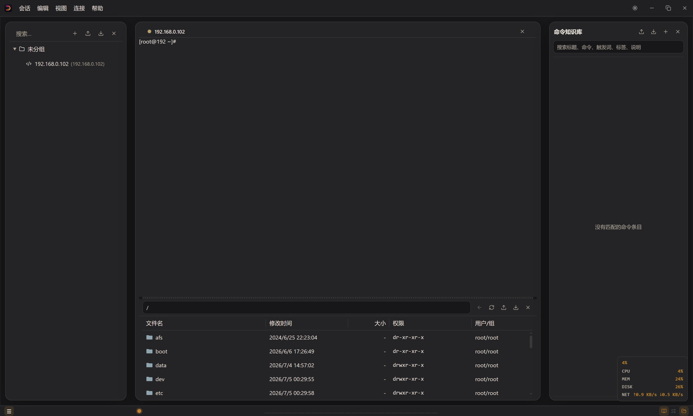

# DuskTerm

<p align="center">
  
</p>

<p align="center">
  <strong>一款面向 SSH 运维与远程连接管理的跨平台桌面终端工具。</strong>
</p>

<p align="center">
  基于 Tauri 2、Rust 和 Vue 3 构建，支持 SSH、SFTP、Telnet、串口和端口隧道管理。
</p>

<p align="center">
  
  
  
  
  
</p>

---

## ✨ 功能特性

| 功能           | 说明                                              |
| ------------ | ----------------------------------------------- |
| 🖥️ 多协议会话    | 支持 SSH、Telnet、Serial 会话的创建、编辑、保存、连接和重连。         |
| 📂 SFTP文件管理 | 支持远程目录浏览、上传、下载、重命名、删除、权限修改和远程文件编辑。              |
| 🧩 多终端工作区    | 支持多终端面板、水平分屏、垂直分屏、焦点切换和状态栏快捷入口。                 |
| 🔀 端口隧道管理    | 支持本地转发、远程转发和动态转发隧道的配置与管理。                       |
| 🔐 本地安全存储    | 敏感字段使用 AES-256-GCM 加密存储，Unix 私钥自动校正为 `0600` 权限。 |
| 📊 状态监控      | 提供 CPU、内存、磁盘和网络等运行状态展示。                         |

## 🖼️ 界面预览

### 终端工作区

<p align="center">
  
</p>


## 🛠️ 技术栈

| 层级            | 技术                          |
| ------------- | --------------------------- |
| 桌面框架       | Tauri 2                     |
| 后端         | Rust、Tokio                  |
| 前端         | Vue 3、Composition API       |
| 状态管理      | Pinia                       |
| 终端模拟       | xterm.js                    |
| 编辑器        | Ace Editor                  |
| UI 基础      | shadcn-vue / reka-ui        |
| SSH / SFTP | russh、russh-keys、russh-sftp |
| 串口通信       | serialport                  |
| 存储加密      | AES-256-GCM                 |
| 构建工具        | Vite 6、pnpm                 |

## 🚀 开发环境

开始开发前，请先安装：

* Node.js 18 或更高版本
* pnpm 8 或更高版本
* Rust stable
* Tauri 2 所需系统依赖：https://tauri.app/start/prerequisites/

安装依赖：

```bash
pnpm install
```

启动桌面开发模式：

```bash
pnpm tauri dev
```

仅启动前端开发服务：

```bash
pnpm dev
```

## ✅ 测试与检查

运行前端测试：

```bash
pnpm test
```

构建前端资源：

```bash
pnpm build
```

检查 Rust / Tauri 后端：

```bash
cd src-tauri
cargo check
```

## 📁 项目结构

```text
src/
  components/          Vue 业务组件
    app-shell/         应用外壳、状态栏及布局组件
    terminal/          终端视图与交互逻辑
    sftp/              SFTP 文件管理面板
    session/           会话配置与连接管理组件
    tunnel/            隧道管理相关组件
  composables/         Vue 组合式逻辑
  stores/              Pinia 状态管理
  utils/               终端、主题、格式化等工具方法

src-tauri/
  src/
    session/           会话监督与运行时管理
    storage/           本地加密存储与数据持久化
    sftp/              SFTP 后端能力
    tunnel/            端口隧道能力
    terminal/          终端写入队列与传输探测
  tauri.conf.json      Tauri 应用配置

docs/
  images/              README 截图、Logo 与宣传图片

```

## 🤝 贡献

提交代码前建议执行：

```bash
pnpm test
pnpm build
cd src-tauri && cargo check
```

欢迎通过 Issue 提交问题、建议或功能需求，也欢迎提交 Pull Request 参与改进。

## 📄 许可证

本项目基于 [MIT License](LICENSE) 开源。
