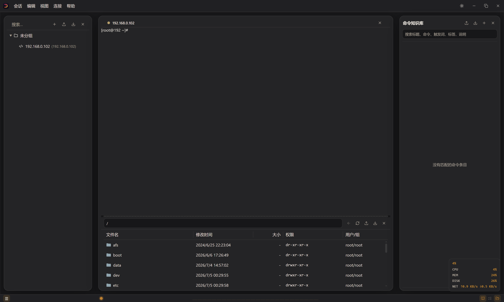

# DuskTerm
<p align="center">
  <strong>一款面向 SSH 运维与远程连接管理的跨平台桌面终端工具。</strong>
</p>

<p align="center">
  基于 Tauri 2、Rust 和 Vue 3 构建，支持 SSH、SFTP、Telnet、串口、本地终端和端口隧道管理。
</p>

<p align="center">
  
  
  
  
  
  
</p>

---

## ✨ 功能特性

| 功能 | 说明 |
| --- | --- |
| 🖥️ 多协议终端 | 支持 SSH、Telnet、Serial，并可快速启动 PowerShell、CMD 等本地终端。 |
| 🗂️ 会话管理 | 支持会话保存、搜索、导入导出、最近访问，以及嵌套分组、排序、置顶和锁定。 |
| 🔑 SSH 连接能力 | 支持密码或私钥认证、登录脚本、SOCKS5 / HTTP 代理、跳板机和主机密钥确认。 |
| 📂 文件管理与传输 | 支持 SFTP 文件管理、拖放上传、ZMODEM `rz` / `sz` 传输，以及统一的全局传输列表。 |
| 🧩 多终端工作区 | 支持多标签、水平/垂直分屏、面板拖动排序、会话总览和多会话同步输入。 |
| 🔀 端口隧道 | 支持本地转发、远程转发和动态 SOCKS 代理，可保存配置并独立启停。 |
| 📚 命令知识库 | 支持命令分类、搜索、导入导出、插入或执行，并可对敏感命令二次确认。 |
| 🔐 安全与存储 | 凭据使用 AES-256-GCM 加密保存，支持 `known_hosts` 校验、敏感命令拦截和应用锁屏。 |
| 🎨 个性化 | 支持终端主题、字体、背景图片、快捷键和可配置桌宠。 |

### 终端与连接

- SSH 会话支持密码、私钥及私钥口令认证，并可配置代理、跳板机、登录脚本和初始端口转发。
- Telnet 与串口会话复用统一终端工作区；串口支持设备枚举、接收区显示以及收发数据日志导出。
- 本地终端基于系统 PTY 启动，在 Windows 上提供 PowerShell 和 CMD 快捷入口。
- SSH 工作区内的分屏终端共享底层连接，同时保持独立 Shell Channel、输入和尺寸状态。
- 同步输入以频道组织多个会话，可选择目标终端并统一发送输入。

### 文件管理与传输

- SFTP 文件管理器支持上传、下载、重命名、删除、权限修改、属性查看和远程文本编辑。
- 文件选择器与系统文件拖入共用同一套 SFTP 上传调度流程，统一执行路径检查、任务创建和批次上传。
- SSH 终端支持通过远端 `rz` 选择本地文件上传，也支持通过 `sz <file>` 选择本地目录下载。
- SFTP 与 ZMODEM 共用全局传输列表，统一展示方向、状态、进度、速率和预计剩余时间；传输开始时会自动展开面板。
- 传输列表支持全部、进行中和失败筛选。进行中的任务可以取消，完成的下载可以在系统文件管理器中定位，完成的上传可以快速进入对应远端目录。
- ZMODEM 文件数据由 Rust 后端直接在 SSH 字节流与本地文件之间传输；传输期间暂停对应终端输入，结束或取消后自动恢复终端。
- 文件管理器支持分页与虚拟滚动、终端当前目录跟随、远程文件属性查看和文本编辑。
- Windows 支持将 SFTP 面板中的远程文件直接拖到资源管理器等文件接收目标；虚拟文件内容使用系统异步拖放协议传输，放下文件后不会因大文件下载持续占用界面线程。
- 拖出下载时，Windows 不会向源应用返回接收方最终保存路径，因此传输列表将目标显示为“系统拖放位置”；文件实际保存在用户放下文件的位置。
- 当前仅支持拖出单个远程文件，不支持直接拖出远程目录。

### 当前限制

- ZMODEM 首版仅支持 SSH 主终端和共享 SSH Shell Channel，并要求远端已经安装可用的 `rz` / `sz` 工具。
- 传输任务暂不支持暂停、恢复、自动重试和断点续传；进行中的任务可以取消。
- SFTP 上传当前只接收文件，选择或拖入文件夹时会忽略该文件夹。
- SFTP、ZMODEM 和端口隧道仅适用于具备相应能力的 SSH 会话，本地、Telnet 和串口会话不会显示不支持的入口。
- 远程文件拖出当前仅在 Windows 上可用。

## 🖼️ 界面预览

### 终端工作区

<p align="center">
  
</p>


## 🛠️ 技术栈

| 层级 | 技术 |
| --- | --- |
| 桌面框架 | Tauri 2 |
| 后端与异步运行时 | Rust、Tokio、crossbeam-channel |
| 前端 | Vue 3、Composition API、Pinia |
| UI 与样式 | Tailwind CSS、shadcn-vue、reka-ui、Lucide |
| 终端 | xterm.js、portable-pty |
| SSH / SFTP / ZMODEM | russh、russh-sftp、zmodem2 |
| 文件编辑 | Ace Editor |
| 表格与树 | TanStack Table、he-tree |
| 系统能力 | serialport、Windows COM / OLE |
| 存储加密 | AES-256-GCM、SHA-256 |
| 构建工具 | Vite 6、pnpm、Cargo |

## 💻 平台说明

- 当前发布配置面向 Windows x64，使用 NSIS 生成当前用户安装包，并自动引导安装 WebView2。
- 核心终端与后端代码保留 Windows / Unix 平台适配；其他平台需要自行安装对应的 Tauri 系统依赖并构建验证。
- Windows 专属能力包括资源管理器原生文件拖放、SFTP 虚拟文件拖出以及 PowerShell / CMD 快捷启动。

## 🚀 开发环境

开始开发前，请先安装：

* Node.js 18 或更高版本
* pnpm 8 或更高版本
* Rust stable
* Tauri 2 所需系统依赖：https://tauri.app/start/prerequisites/

安装依赖：

```bash
pnpm install
```

启动桌面开发模式：

```bash
pnpm tauri dev
```

仅启动前端开发服务：

```bash
pnpm dev
```

打包分发：

```bash
pnpm install --frozen-lockfile
pnpm desktop:build
```

构建调试安装包：

```bash
pnpm desktop:build:debug
```

## ✅ 测试与检查

运行前端测试：

```bash
pnpm test
```

构建前端资源：

```bash
pnpm build
```

检查 Rust / Tauri 后端：

```bash
cd src-tauri
cargo check
```

运行终端传输核心与 ZMODEM 协议测试：

```bash
cargo test --manifest-path src-tauri/crates/terminal-transfer-core/Cargo.toml
cargo test --manifest-path src-tauri/crates/zmodem2/Cargo.toml
```

## 📁 项目结构

```text
src/
  components/          Vue 业务组件
    app-shell/         标题栏、锁屏、传输列表及应用布局
    common/            通用展示组件
    knowledge/         命令知识库
    misc/              桌宠等辅助功能
    session/           会话配置与连接管理组件
    settings/          设置中心
    sftp/              SFTP 文件管理与远程编辑器
    terminal/          终端视图、分屏与同步输入
    tunnel/            隧道管理相关组件
    ui/                基础 UI 组件
  composables/         Vue 组合式逻辑
  stores/              Pinia 状态管理
  utils/               IPC、终端、主题、拖放及格式化工具

src-tauri/
  crates/
    terminal-transfer-core/ ZMODEM 探测、终端字节流复用与恢复状态机
    zmodem2/               隔离维护的 ZMODEM 协议实现与兼容性补丁
  src/
    native_drag/       Windows 本地文件与 SFTP 虚拟文件拖放
    session/           会话监督与运行时管理
    sftp/              SFTP 后端能力
    ssh/               SSH 连接、Shell Channel 与会话管理
    storage/           本地加密存储与数据持久化
    terminal_transfer/ ZMODEM 运行时、文件落盘与同名处理
    tunnel/            端口隧道能力
    background.rs      背景图片导入与缓存
    local_terminal.rs  本地 PTY 终端
    terminal_transfer.rs 终端传输命令、事件与公共数据模型
  tauri.conf.json      Tauri 应用配置

docs/
  images/                              README 截图与宣传图片
```

## 🤝 贡献

提交代码前建议执行：

```bash
pnpm test
pnpm build
cd src-tauri && cargo check
```

欢迎通过 Issue 提交问题、建议或功能需求，也欢迎提交 Pull Request 参与改进。

## 📄 许可证

本项目基于 [MIT License](LICENSE) 开源。
